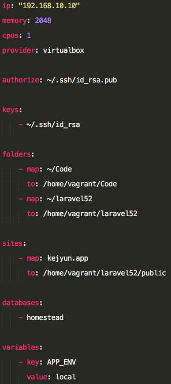
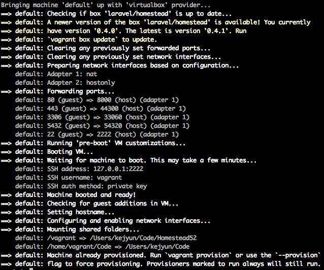
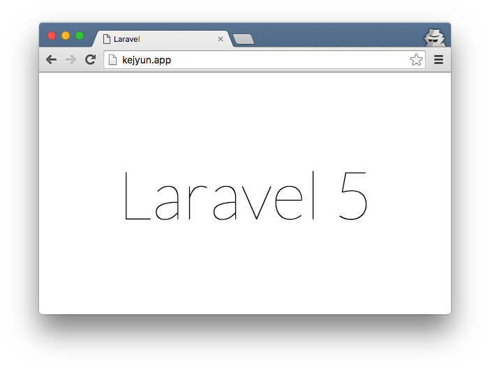

# Homestead

常常我我們需要開發Web Application時候，都需要花很長的時間把環境建置起來，而Homestead以讓我們透過簡單的設定檔，輕鬆的建置好整個執行環境，讓我們能夠更專注於在開發上

> OSX El Capitan 10.11.3

> Laravel 5.2

> Vagrant 1.8.1

> Virtualbox 5.0.14


## 安裝 Virtualbox

從 [VirtualBox 官方網站](https://www.virtualbox.org/wiki/Downloads) 下載並安裝 VirtualBox

下載連結：http://download.virtualbox.org/virtualbox/5.0.14/VirtualBox-5.0.14-105127-OSX.dmg


## 安裝 Vagrant

從 [Vagrant 官方網站](https://www.vagrantup.com/downloads.html) 下載並安裝 Vagrant

下載連結：https://releases.hashicorp.com/vagrant/1.8.1/vagrant_1.8.1.dmg

## 安裝 Homestead Vagrant Box

在 VirtualBox 及 Vagrant 安裝完後，使用下列指令將 Homestead 加入您的虛擬主機中

```shell
vagrant box add laravel/homestead
```

## 使用 Git 複製 Laravel homestead 並建立 Homestead 設定檔

```shell
$ git clone https://github.com/laravel/homestead.git Homestead
$ cd Homestead
~/Homestead$ bash init.sh
```


## 建立ssh key
```shell
$ ssh-keygen -t rsa -C "kejyun@homestead"
```

## 編輯 Homestead 設定檔

```shell
$ vim  ~/.homestead/Homestead.yaml
```

確認設定檔中ssh key有對應到正確的路徑

```
authorize: ~/.ssh/id_rsa.pub
keys:
    - ~/.ssh/id_rsa
```

## 設定虛擬主機提供者

vagrant 支援 `virtualbox`, `vmware_fusion` 或 `vmware_workstation` 這幾個虛擬主機，我們使用 VirtualBox 所以就填入 virtualbox

```
provider: virtualbox
```

### 設定本機程式碼路徑對應到測試環境的路徑共用資料夾

> map：本機路徑

> to：Vagrant測試機路徑


#### 程式路徑

```
folders:
    - map: ~/Code
      to: /home/vagrant/Code
    - map: ~/laravel52
      to: /home/vagrant/laravel52
```

#### 網站路徑

```
sites:
    - map: kejyun.app
      to: /home/vagrant/laravel52/public
```




## 設定 `/ect/hosts` 對應本機網址到 Vagrant

```shell
$ sudo vim /etc/hosts
```

加入下列設定

```
192.168.10.10   kejyun.app
```

> IP 位址為 Homestead.yaml 設定中的 ip 設定值，kejyun.app 則是參照設定檔中的 sites map 設定有哪些則加進去 hosts 設定檔中

## 啟動 Vagrant

```shell
~/Homestead $ vagrant up
```

> 在剛剛使用Git複製下來的homestead資料夾中執行vagrant up指令，會自動下載virtualbox相關的虛擬主機設定，並依照設定檔設置虛擬主機。




設定完成後可以開啟瀏覽器到 [http://kejyun.app](http://kejyun.app) 看看Homestead是否有正常啟動，若看到下列畫面表示可以正常運作了！！！



## 備註

若要關閉Homestead虛擬機器，則可以使用下列指令關閉

```shell
vagrant halt
```

若設定檔有修改要重新讀取，則可以使用下列指令重新讀取設定

```shell
vagrant provision
```

## 參考資料
* [Say Hello to Laravel Homestead 2.0](https://laracasts.com/lessons/say-hello-to-laravel-homestead-two)
* [Laravel - Homestead](http://laravel.com/docs/5.2/homestead)
* [Virtualbox](https://www.virtualbox.org/wiki/Downloads)
* [Vagrant](http://www.vagrantup.com/downloads.html)
* [Vagrant 常用指令](http://blog.kejyun.com/2014/10/vagrant-command.html)
