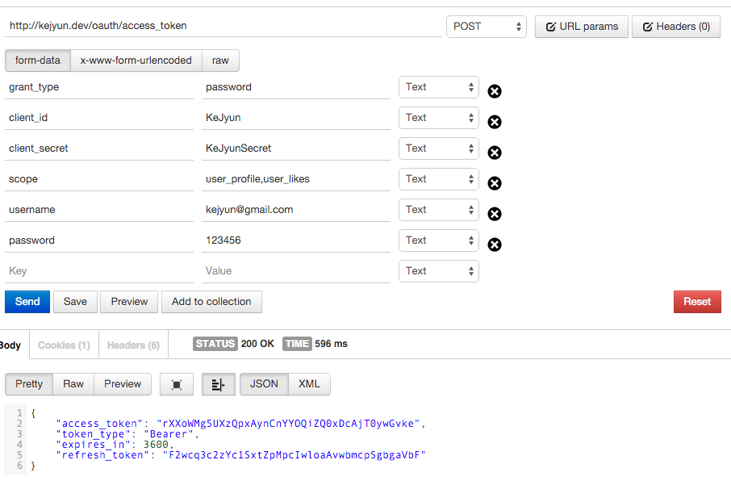

# OAuth2 Password Grant With Scope

延續 [Password Grant](package-auth-oauth2-password-grant.md) 的 OAuth2 設定，我們可以在參數中加入我們要取得的 `資源存取範圍（Scope）`，讓這個 Access Token 僅能有特定資源的存取權限

## 新增資源存取範圍（Scope）資料

OAuth2 定義的 Scope 皆存在 `oauth_scopes` 資料表中，我們在資料表中新增 `user_profile` 及 `user_likes` 這兩個 Scope

```sql
INSERT INTO "oauth_scopes" ("id", "description", "created_at", "updated_at")
VALUES ('user_profile', 'profile', now(), now());

INSERT INTO "oauth_scopes" ("id", "description", "created_at", "updated_at")
VALUES ('user_likes', 'likes', now(), now());
```

## 取得 Access token

在我們取得 Access token 的資料欄位中填入下列欄位

| 欄位名稱 | 資料 |
|---|---|
| grant_types | password |
| username | kejyun@gmail.com |
| password | 123456 |
| client_id | KeJyun |
| client_secret | KeJyunSecret |
| scope | user_profile,user_likes |

> 我們的 Scope 也可以指填入一個，若要填入多個 Scope 的話，可以看 `config/oauth2.php`  設定檔中的 `scope_delimiter` 要怎麼區別不同的 Scope 資源，預設是用`逗號「,」`去區別 Scope




送出到我們設定的 `/oauth/access_token` 路由後，我們就可以直接取得 `access_token`，並回傳此 token 失效的時間 `expires_in` 為我們設定的 `access_token_ttl`

## 相關資料表

OAuth2 會將 token 記錄在 `oauth_access_tokens` 資料表，並將關聯的使用者記錄在 `oauth_sessions` 資料表，而 `oauth_access_token_scopes` 資料表則存放 Access Token 相關的 Scope 資訊

## 參考資料
* [Securing your API endpoints](https://github.com/lucadegasperi/oauth2-server-laravel/wiki/Securing-your-API-endpoints#defining-scopes)
