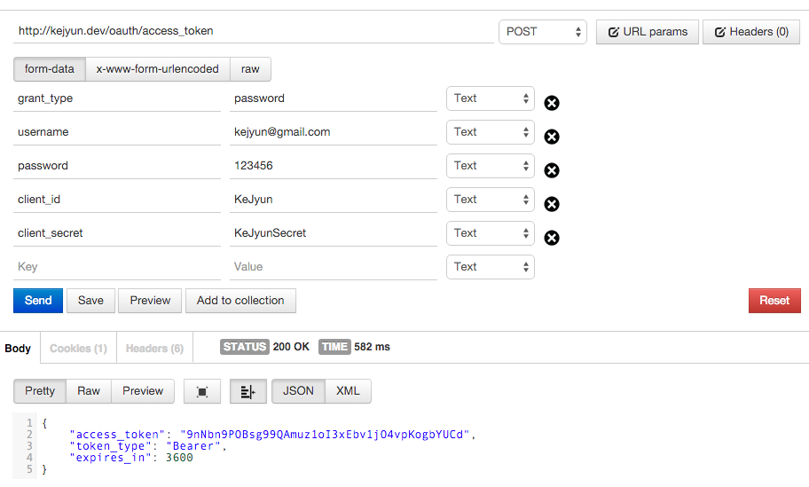

# OAuth2 Password Grant


## 設定 config

在 `config/oauth2.php` 檔案中加入下列設定，並設定你的 `token 存活時間(access_token_ttl)`，單位時間為秒，在 `callback` 設定您要用來驗證使用者帳號密碼的類別函式，OAuth2 會透過這個 callback 去驗證使用者的帳號密碼

```php
return [
    'grant_types' => [
        'password' => [
            'class' => '\League\OAuth2\Server\Grant\PasswordGrant',
            'callback' => '\App\PasswordVerifier@verify',
            'access_token_ttl' => 3600
        ],
    ]
];
```

## 建立驗證身份 callback

OAuth 會將 Client 傳來的 `username` 及 `password` 欄位的資料透過 `callback` 傳入並驗證，當中驗證的規則跟邏輯你可以自行定義，若驗證失敗回傳 `false` 即可，驗證成功的話可以將使用者的編號回傳，OAuth 會將 Access token 對應的使用者編號（資源擁有者編號）記錄下來

```php
use Illuminate\Support\Facades\Auth;

class PasswordGrantVerifier
{
  public function verify($username, $password)
  {
      $credentials = [
        'email'    => $username,
        'password' => $password,
      ];

      // 驗證成功
      if (Auth::once($credentials)) {
          return Auth::user()->id;
      }

      // 驗證失敗
      return false;
  }
}
```


## 取得 Access token

在我們取得 Access token 的資料欄位中填入下列欄位

| 欄位名稱 | 資料 |
|---|---|
| grant_types | password |
| username | kejyun@gmail.com |
| password | 123456 |
| client_id | KeJyun |
| client_secret | KeJyunSecret |

> `client_id` 與 `client_secret` 為在 [OAuth 套件說明頁](package-auth-oauth2-README.md) 建立的

> `username` 與 `password` 是你專案的使用者驗證資料，端看你驗證的 `callback` 如何定義這兩個欄位的資料，驗證成功後回傳使用者的編號給 OAuth2 記錄即可




送出到我們設定的 `/oauth/access_token` 路由後，我們就可以直接取得 `access_token`，並回傳此 token 失效的時間 `expires_in` 為我們設定的 `access_token_ttl`

## 相關資料表

OAuth2 會將 token 記錄在 `oauth_access_tokens` 資料表，並將關聯的使用者記錄在 `oauth_sessions` 資料表，在 `oauth_sessions` 中的 `owner_id` 則為我們剛剛回傳的使用者編號

## 參考資料
* [Password Grant](https://github.com/lucadegasperi/oauth2-server-laravel/wiki/Implementing-an-Authorization-Server-with-the-Password-Grant)
